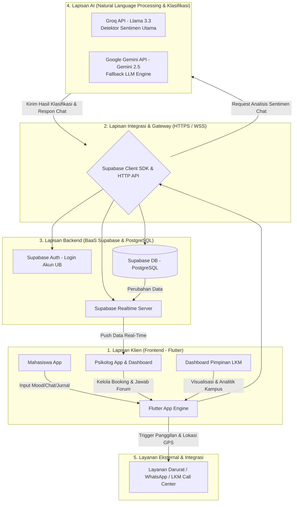
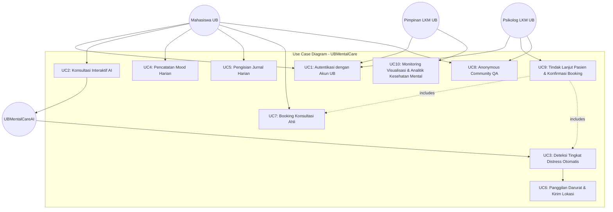
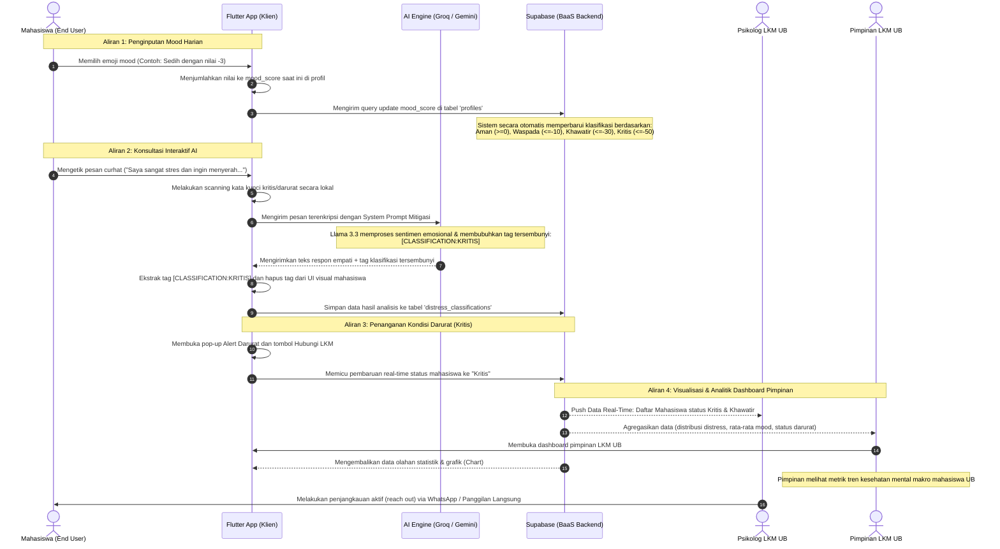

# Dokumentasi Arsitektur Perangkat Lunak & Aliran Data: UBMentalCare

Dokumen ini menjelaskan arsitektur perangkat lunak, rancangan basis data, fungsionalitas sistem, dan mekanisme aliran data pada aplikasi **UBMentalCare** dari input mahasiswa (pengguna akhir) hingga menjadi analitik yang divisualisasikan pada dashboard pimpinan Lembaga Konseling Mahasiswa (LKM) Universitas Brawijaya.

---

## 1. Skema Arsitektur High-Level (High-Level Architecture)

Aplikasi **UBMentalCare** dibangun menggunakan pendekatan modern berbasis **BaaS (Backend-as-a-Service)** dengan integrasi kecerdasan buatan (AI) untuk klasifikasi emosional secara real-time.

### Diagram Arsitektur High-Level

### Penjelasan Komponen Arsitektur:
1. **Lapisan Klien (Flutter Mobile App):**
   * **Mahasiswa App:** Antarmuka pengguna untuk mahasiswa UB mengekspresikan mood harian, menulis jurnal, melakukan chat mitigasi dengan AI, melakukan *booking* psikolog, dan memicu panggilan darurat jika kritis.
   * **Psikolog App:** Panel bagi psikolog LKM UB untuk memantau mahasiswa bimbingan, menjawab forum *community*, dan mengonfirmasi jadwal konsultasi.
   * **Dashboard Pimpinan:** Antarmuka visual (chart, metrik) yang menampilkan agregat statistik kesehatan mental mahasiswa UB secara *real-time*.
2. **Lapisan Integrasi & Gateway (Supabase SDK & HTTP Client):** Mengamankan komunikasi antara klien dan server menggunakan token JWT.
3. **Lapisan Backend (Supabase BaaS & PostgreSQL Database):**
   * **Supabase Auth:** Autentikasi ketat menggunakan format email Universitas Brawijaya (`@student.ub.ac.id` untuk mahasiswa dan `@psychologist.ub.ac.id` untuk psikolog).
   * **Supabase Database (PostgreSQL):** Penyimpanan data terstruktur dengan relasi dinamis.
   * **Supabase Realtime:** Mengirim pembaruan instan ke perangkat psikolog apabila ada mahasiswa yang masuk ke tingkat distress berbahaya (**Khawatir** atau **Kritis**).
4. **Lapisan AI (Groq & Gemini API):**
   * **Groq API (Llama 3.3):** Digunakan sebagai pendeteksi utama karena kecepatan tinggi dalam memproses teks curhat mahasiswa dan melakukan klasifikasi distress level.
   * **Google Gemini API (Gemini 2.5):** Berperan sebagai sistem *fallback* otomatis apabila Groq API mengalami limitasi atau kegagalan jaringan.
5. **Layanan Eksternal (WhatsApp & Emergency Services):** Menghubungkan langsung mahasiswa kritis dengan LKM UB via WhatsApp link atau panggilan telepon darurat beserta koordinat lokasi GPS mahasiswa.

---

## 2. Diagram Use Case (Use Case Diagram)

Diagram di bawah ini menggambarkan interaksi antara berbagai Aktor (Mahasiswa, Psikolog, Pimpinan LKM, dan ResahAI/UBMentalCareAI) dengan fitur-fitur utama di dalam sistem.

---

## 3. Entity Relationship Diagram (ERD)

Desain basis data relasional yang mendasari sistem UBMentalCare, memastikan integritas data mahasiswa, klasifikasi AI, mood tracker harian, hingga log booking konsultasi psikolog.

```mermaid
erDiagram
    PROFILES {
        uuid id PK "Relasi ke auth.users Supabase"
        string nickname "Nama panggilan/samaran mahasiswa"
        string gender "Jenis kelamin"
        date birth_date "Tanggal lahir"
        string phone_number "Nomor WhatsApp aktif"
        string role "Role: student | psychologist | pimpinan"
        boolean is_onboarding_completed "Status penyelesaian onboarding"
        integer mood_score "Mood akumulatif yang mempengaruhi status kesehatan mental"
        timestamp created_at "Waktu registrasi"
    }

    DISTRESS_CLASSIFICATIONS {
        uuid id PK "ID unik klasifikasi"
        uuid user_id FK "Menunjuk ke PROFILES.id"
        integer level "Skala distress: 1=Aman, 2=Waspada, 3=Khawatir, 4=Kritis"
        string level_label "Label teks: Aman, Waspada, Khawatir, Kritis"
        string summary "Rangkuman curhat singkat hasil ekstraksi AI"
        string[] keywords "Kata kunci pemicu kecemasan"
        timestamp created_at "Waktu deteksi"
    }

    MOOD_LOGS {
        uuid id PK "ID pencatatan harian"
        uuid user_id FK "Menunjuk ke PROFILES.id"
        integer mood_value "Nilai: Sedih(-3), Biasa(0), Senang(+1), Gembira(+2), Bahagia(+3)"
        string notes "Catatan singkat opsional"
        date logged_date "Tanggal pencatatan (Constraint: 1 entry per hari)"
    }

    JOURNALS {
        uuid id PK "ID jurnal"
        uuid user_id FK "Menunjuk ke PROFILES.id"
        string title "Judul tulisan jurnal"
        text content "Konten refleksi emosi"
        integer mood_rating "Rating mood 1-5"
        timestamp created_at "Tanggal penulisan"
    }

    BOOKINGS {
        uuid id PK "ID pemesanan jadwal"
        uuid student_id FK "Menunjuk ke PROFILES.id (Student)"
        uuid psychologist_id FK "Menunjuk ke PROFILES.id (Psychologist)"
        timestamp scheduled_at "Tanggal dan jam konsultasi"
        string status "Status: pending | confirmed | cancelled"
        text notes "Keluhan atau catatan awal pasien"
    }

    COMMUNITY_POSTS {
        uuid id PK "ID post forum"
        uuid student_id FK "Menunjuk ke PROFILES.id (Student)"
        boolean is_anonymous "Flag anonimitas"
        text question "Pertanyaan dari mahasiswa"
        uuid answered_by FK "Menunjuk ke PROFILES.id (Psychologist)"
        text answer "Jawaban profesional dari psikolog"
        timestamp created_at "Waktu pembuatan"
    }

    PROFILES ||--o{ DISTRESS_CLASSIFICATIONS : "memiliki"
    PROFILES ||--o{ MOOD_LOGS : "mencatat"
    PROFILES ||--o{ JOURNALS : "menulis"
    PROFILES ||--o{ BOOKINGS : "memesan (sebagai mahasiswa)"
    PROFILES ||--o{ BOOKINGS : "mengelola (sebagai psikolog)"
    PROFILES ||--o{ COMMUNITY_POSTS : "membuat (sebagai mahasiswa)"
    PROFILES ||--o{ COMMUNITY_POSTS : "menjawab (sebagai psikolog)"
```

---

## 4. Aliran Data End-to-End (Data Flow Diagram)

Diagram berikut menjelaskan secara sekuensial bagaimana data bergerak dari input mahasiswa (mood harian & AI chat) hingga diproses dan disajikan pada dashboard pimpinan/psikolog secara real-time.

---

## 5. Mekanisme Pemrosesan Menjadi Analitik & Informasi

Bagaimana data mentah bertransformasi menjadi visualisasi bernilai tinggi untuk dashboard pimpinan? Berikut alurnya:

### A. Transformasi Data Mentah ke Informasi
1. **Poin Mood harian (`MOOD_LOGS`)** diakumulasikan secara *rolling summation* pada tabel `profiles.mood_score`. Nilai negatif yang terus menurun menunjukkan tren depresi.
2. **Interaksi Chat (`distress_classifications`)** diubah menjadi data kategorikal berbobot (skala 1-4).
3. **Log Booking (`bookings`)** digunakan untuk memantau tingkat kegawatan kasus yang sukses ditangani versus kasus aktif.

### B. Visualisasi pada Dashboard Pimpinan
Data yang telah dikelompokkan oleh Supabase diproyeksikan dalam bentuk:
* **Pie Chart Distribusi Distress:** Menunjukkan proporsi jumlah mahasiswa Universitas Brawijaya yang berada dalam status *Aman, Waspada, Khawatir,* dan *Kritis*. Berguna bagi pimpinan untuk menentukan urgensi kampanye kesehatan mental.
* **Line Chart Tren Mood Bulanan:** Mengukur rata-rata kebahagiaan mahasiswa dari waktu ke waktu (misal: penurunan tajam saat minggu ujian/UTS/UAS).
* **Bar Chart Beban Kerja Psikolog:** Memperlihatkan statistik booking konsultasi aktif per psikolog LKM untuk optimasi alokasi SDM.
* **Tabel Perhatian Khusus (Real-Time):** Menampilkan daftar mahasiswa kritis secara real-time berdasarkan akumulasi point mood terendah (`<= -50`) dan analisis sentimen AI, lengkap dengan tombol penjangkauan klinis instan.

Dengan demikian, dari sekadar input emoji mood dan ketikan curhat sederhana oleh mahasiswa, sistem berhasil merumuskan indikator kesehatan mental kampus secara komprehensif bagi pimpinan Universitas Brawijaya untuk pengambilan kebijakan strategis.
